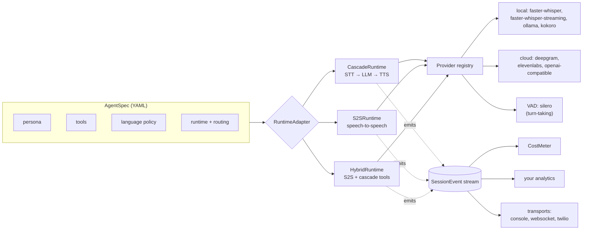
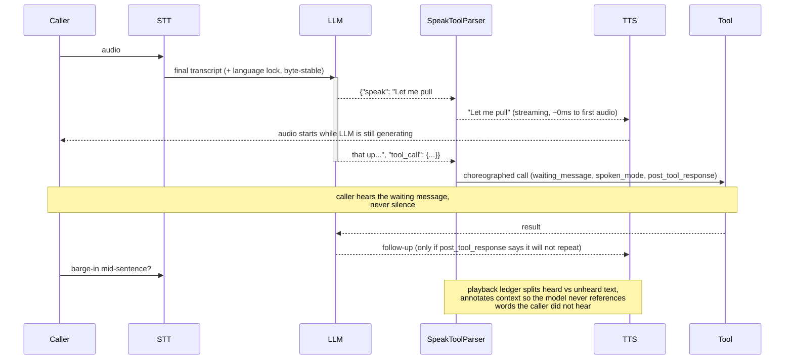

# Tring 🔔

**The open-source voice agent stack. One agent contract, any runtime, honest costs.**

[](https://pypi.org/project/tring/)
[](https://pypi.org/project/tring/)
[](https://github.com/anzal1/tring/actions/workflows/ci.yml)
[](LICENSE)

Tring is the sound of an arriving call. Define a voice agent once, in plain YAML, and run it on any of three architectures without rewriting anything:

- **Cascade**: STT → LLM → TTS, maximum control
- **Speech-to-speech**: one end-to-end audio model, minimum latency
- **Hybrid**: S2S conversation with cascade-grade tooling

Same tools, same analytics, same cost attribution on every runtime. Switching a deployment from one architecture to another is a config change, not a migration.

```bash
pip install tring
```

**[▶ Watch the 2-minute demo](https://github.com/anzal1/tring/releases/download/v0.4.0/tring-demo.mp4)** — a live agent booking an appointment through a choreographed tool call, the flow builder compiling a canvas into an agent, and session replay, all in Tring Studio.

Built from lessons learned running voice agents across hundreds of thousands of production telephony calls, in multiple languages, where callers code-switch mid-sentence and two seconds of silence means a hangup.

---

## Contents

- [Why Tring](#why-tring)
- [Sixty-second quickstart](#sixty-second-quickstart)
- [Architecture](#architecture)
- [The four latency primitives](#the-four-latency-primitives)
- [Choosing a runtime](#choosing-a-runtime)
- [Providers](#providers)
- [The cost engine](#the-cost-engine)
- [Tring Studio](#tring-studio)
- [Build on top of Tring](#build-on-top-of-tring)
- [Project layout](#project-layout)
- [Roadmap and contributing](#roadmap-and-contributing)

---

## Why Tring

**Latency is a correctness property.** In a text agent, latency is an annoyance. In a voice agent, it is a conversational error: the caller assumes the line dropped, talks over the bot, and the turn is lost. Tring ships four primitives that make dead air structurally impossible instead of patching it after the fact.

**Local-first, not local-as-demo.** The default pipeline runs entirely on open models: faster-whisper for STT, Ollama for the LLM, Kokoro for TTS. Zero cloud dependencies, zero per-minute cost. Cloud providers are opt-in upgrades, wired through the same interfaces.

**Honest cost accounting.** Every metered unit carries an `estimated` flag. Exact vendor-reported usage is preferred; estimates are never silently substituted. Reports roll costs up per call, per connected minute, per conversation, and per outcome, because a 4x spread between the cheapest and most expensive provider stack is dwarfed by conversation quality. Optimize the denominator, not the rate.

**Per-language provider routing.** Real callers code-switch. Most ASR engines silently drop the part they cannot handle and return a clean, plausible, wrong transcript, which is invisible on every dashboard. Tring routes STT, TTS, and LLM per agent and per detected language.

---

## Sixty-second quickstart

```yaml
# agent.yaml
name: front-desk
persona: |
  You are a friendly front-desk assistant for a dental clinic.
greeting: "Hi! How can I help you today?"
language:
  primary: en
runtime:
  mode: cascade
  routing:
    default: { stt: text_input, llm: ollama, tts: kokoro }
tools:
  - name: check_appointment
    description: Look up a patient's next appointment by phone number.
    parameters:
      type: object
      properties:
        phone: { type: string }
      required: [phone]
```

```python
import asyncio
from tring import AgentSpec, CallSession
from tring.runtimes.cascade import CascadeRuntime
from tring.cost.meter import CostMeter
from tring.cost.rates import DEFAULT_RATES
from tring.transports.console import ConsoleTransport

async def check_appointment(args: dict) -> dict:
    return {"next": "Tuesday 3pm", "phone": args["phone"]}

async def main() -> None:
    agent = AgentSpec.from_yaml("agent.yaml")
    session = CallSession(agent)
    runtime = CascadeRuntime(
        session,
        handlers={"check_appointment": check_appointment},
        meter=CostMeter(session, DEFAULT_RATES),
    )
    await ConsoleTransport(runtime).run()

asyncio.run(main())
```

Run `ollama serve` and `ollama pull mistral`, then run the script and start typing. That is a full agent loop: streaming generation, choreographed tool calls, cost lines on every turn. Swap `text_input` for `faster_whisper` and add the websocket transport for real audio (`pip install "tring[local,transports]"`). See [`examples/`](examples/) for runnable versions.

---

## Architecture

Everything integrates through one event stream. Runtimes emit unified `SessionEvent`s; consumers (cost metering, analytics, transports, your code) subscribe to the session and never import a concrete runtime.



### Anatomy of one choreographed turn

The sequence below is where most of Tring's value lives. The LLM answers in a strict envelope, `{"speak": ..., "tool_call": ...}`, with `speak` first. A character-level parser streams speak text to TTS while the tool call is still being generated, and the schema forces the model to plan the silence around every tool call.



---

## The four latency primitives

Each is an independent, framework-free module under [`tring/primitives/`](src/tring/primitives/), fully unit-tested, usable outside Tring's runtimes.

| Primitive | Problem it kills | How |
|---|---|---|
| [`speak_parser`](src/tring/primitives/speak_parser.py) | Waiting for complete JSON before speaking adds a full generation of latency | Character-level state machine streams the `speak` field to TTS mid-generation, handles escapes split across chunks, falls back to plain speech so a call never goes silent |
| [`choreography`](src/tring/primitives/choreography.py) | Dead air during tool execution | `waiting_message`, `spoken_mode`, and `post_tool_response` are required fields of every tool call's schema. The model cannot call a tool without planning what the caller hears. Failures force a spoken explanation |
| [`interruption`](src/tring/primitives/interruption.py) | TTS generates faster than audio plays, so after a barge-in the model confidently references words the caller never heard | A playback ledger tracks generated vs actually-played text, splits heard/unheard at a word boundary, and annotates context only on genuine interrupts, not normal turn-taking |
| [`language_lock`](src/tring/primitives/language_lock.py) | Models drift to English mid-conversation; the naive per-turn fix silently destroys prompt caches | The directive is folded into exactly one trailing message, keeping the prior message array byte-identical across turns (proven by a prefix-stability test) |

---

## Choosing a runtime

| | Cascade | Speech-to-speech | Hybrid |
|---|---|---|---|
| Live transcripts | ✅ mid-turn | ❌ post-call only | ❌ post-call only |
| Mid-call tool calls | ✅ | ✅ | ✅ |
| Barge-in | ✅ | ✅ | ✅ |
| Exact usage reporting | ✅ | ❌ | partial |
| Runs 100% locally | ✅ | ❌ | ❌ |
| Voice ownership / cloning control | high | provider-bound | mixed |

Each runtime declares these as [`RuntimeCapabilities`](src/tring/runtimes/base.py); consumers query them instead of assuming. When an architecture has no mid-call transcripts, Tring says so in the event stream (`availability: post_call`) rather than pretending.

**Streaming STT:** Use `faster_whisper_streaming` for true incremental transcription (character by character) instead of buffered phrases. Starts the LLM turn before the caller finishes, saving hundreds of milliseconds of perceived latency.

**VAD turn-taking:** Pair cascade with Silero VAD (local, vendor-free) for natural turn-taking. The runtime stops listening and starts speaking when the caller falls silent, with configurable sensitivity.

**Twilio ingress:** The `twilio` transport bridges Twilio media streams with exact playout marks for perfect interruption reconciliation. Use `runtime.ledger.mark_played()` to upgrade heard/unheard splits from estimated to exact.

The triangle is real: **latency, control, voice ownership. Pick two.** Cascade maximizes control, S2S minimizes latency, hybrid buys voice ownership at a premium. Tring's job is making the choice reversible.

---

## Providers

All providers are lazy-loaded. The core install pulls only `pydantic` and `pyyaml`; vendor SDKs are never imported unless selected. API keys are referenced by environment variable name, never stored in specs.

| Slot | Local | Cloud |
|---|---|---|
| STT | `faster_whisper`, `text_input` | `deepgram`, `assemblyai`, `openai_stt`, `sarvam` |
| LLM | `ollama` | `openai_compatible`, `anthropic`, `gemini` |
| TTS | `kokoro`, `piper` | `elevenlabs`, `openai_tts`, `sarvam_tts`, `cartesia` |
| S2S | | `openai_realtime`, `ultravox` |

Full provider reference: [docs/PROVIDERS.md](docs/PROVIDERS.md)

Routing is per-language, because the best engine for one language is often the wrong one for another:

```yaml
runtime:
  mode: cascade
  routing:
    default: { stt: deepgram, llm: openai_compatible, tts: elevenlabs }
    mr:      { stt: faster_whisper, llm: ollama, tts: kokoro }   # Marathi routes differently
```

---

## The cost engine

Every provider reports `Usage`; the `CostMeter` prices it against a versioned rate card and emits `CostRecorded` events. Anything inferred rather than vendor-reported is flagged `estimated: true`, and cached prompt tokens are tracked separately, so a silent cache regression cannot masquerade as normal operation.

```text
component  provider           units          amount    estimated
─────────  ─────────────────  ─────────────  ────────  ─────────
stt        deepgram           182.4 audio_s  $0.0079   no
llm        openai_compatible  14,200 tok_in  $0.0021   no (9,800 cached)
llm        openai_compatible  610 tok_out    $0.0004   no
tts        elevenlabs         1,240 chars    $0.0372   no
─────────  total                             $0.0476
```

Then the part nobody else does, the **denominator ladder**:

```python
from tring.cost.report import denominator_ladder

denominator_ladder(
    total_cost_all_calls=8_750.0,
    dials=100_000, connected=24_000, conversations=21_000, outcomes=340,
)
# cost_per_dial=$0.0875  cost_per_connected=$0.36
# cost_per_conversation=$0.42  cost_per_outcome=$25.74
```

Rate optimization moves the top line by percents. Conversation quality moves the bottom line by multiples. The ladder makes that visible.

---

## Tring Studio

The workbench: design, test, and debug agents in the browser, no audio hardware or model downloads required. The same event stream and cost metering runs live, so you see the exact choreography and price your production calls will pay.

```bash
pip install "tring[transports]"
tring studio
```

Opens at `http://localhost:8900` ([watch the demo](https://github.com/anzal1/tring/releases/download/v0.4.0/tring-demo.mp4)):

- **Build**: the agent designer (form or raw YAML), a live test console with typed turns or **push-to-talk from your microphone**, tool-call cards showing the choreographed waiting messages, and live cost lines with the estimated-fraction honesty chip.
- **Flow**: draw conversation flows on a canvas (say / ask / branch / tool / handoff / end) and compile them into numbered, transition-explicit agent instructions. The graph round-trips losslessly in the spec's metadata, and nothing saves without your explicit action.
- **Sessions**: every call persists as its event stream; scrub any past conversation through the same panels you use live, tool calls and costs included.

Declared tools get studio mock handlers automatically, so you can test conversation logic with zero backend code. Deployment options, containers included, are in [docs/DEPLOYMENT.md](docs/DEPLOYMENT.md).

---

## Build on top of Tring

Tring is a stack, but every layer is a public extension point. The five ways people build on it:

### 1. Add a provider (most common)

Any STT/LLM/TTS/S2S service or model becomes a Tring provider by implementing one streaming interface and registering a factory. Lazy-import your SDK inside methods so the core stays light:

```python
# my_pkg/providers.py
from collections.abc import AsyncIterator
from tring.providers.base import LLMChunk, LLMProvider, Usage
from tring.providers.registry import register

@register("llm", "my_llm")
def _make(**options):
    return MyLLM(model=options.get("model", "default"))

class MyLLM(LLMProvider):
    name = "my_llm"

    def __init__(self, model: str) -> None:
        self.model = model

    async def generate(self, messages, tools=None) -> AsyncIterator[LLMChunk]:
        async for delta in my_sdk.stream(self.model, messages, tools):
            yield LLMChunk(text=delta.text)
        yield LLMChunk(text="", finish=True, usage=[
            Usage(units=exact_in, unit_name="tokens_in", estimated=False),
            Usage(units=exact_out, unit_name="tokens_out", estimated=False),
        ])
```

Import your module once, and every agent YAML in existence can now say `llm: my_llm`. Ship a rate-card entry with it and the cost engine prices it automatically.

### 2. Add tools (the app layer)

Tools are plain async functions plus a YAML declaration. Choreography is applied automatically, so your tool inherits the no-dead-air guarantee for free:

```python
async def create_lead(args: dict) -> dict:
    return await crm.upsert(phone=args["phone"], name=args.get("name"))

runtime = CascadeRuntime(session, handlers={"create_lead": create_lead})
```

This is the layer where a CRM integration, a booking system, or an entire vertical product (admissions, collections, support) lives: your business logic, Tring's conversation machinery.

### 3. Consume the event stream (analytics, dashboards, compliance)

Every runtime emits the same typed events. Subscribe and build whatever you want on top: live dashboards, QA tooling, transcript stores, alerting:

```python
async for event in session.subscribe():
    match event.type:
        case "user_transcript":
            db.save_turn(event)
        case "interruption":
            metrics.incr("barge_in")
        case "cost_recorded":
            ledger.add(event.amount, event.estimated)
        case "tool_call_completed" if not event.ok:
            alerts.page(event.tool_name)
```

An observability product for voice agents is one `subscribe()` loop away.

### 4. Bring your own transport (telephony, WebRTC, apps)

A transport is anything that moves 16kHz mono PCM in and out. The websocket server shows the pattern in about a hundred lines; a SIP/FreeSWITCH bridge, a Twilio media-streams adapter, a WebRTC gateway, or a native app all plug in the same way. Tring ships a Twilio transport for MediaStreams with playout-aware interruption tracking:

```python
from tring.transports.websocket import serve

def factory(session):
    return CascadeRuntime(session, handlers=my_handlers,
                          meter=CostMeter(session, my_rates))

await serve(factory, port=8765)   # binary in: caller PCM, binary out: bot PCM
```

Transports with a real playout clock can drive `runtime.ledger.mark_played()` directly for exact interruption reconciliation.

### 5. Write a runtime (the deep end)

New architecture (a new S2S vendor, an on-device duplex model, a research pipeline)? Subclass `RuntimeAdapter`, emit the standard events, declare honest `RuntimeCapabilities`, and every existing tool, transport, cost meter, and analytics consumer works with it unchanged. The [cascade runtime](src/tring/runtimes/cascade.py) is written to be read; it is the reference.

Or skip the stack entirely and use the primitives à la carte: `SpeakToolParser`, the choreography schema, `PlaybackLedger`, and `LanguageLock` have no dependency on Tring's runtimes and drop into Pipecat, LiveKit Agents, or hand-rolled pipelines.

Full guide with contracts and testing patterns: [docs/EXTENDING.md](docs/EXTENDING.md).

---

## Project layout

```text
src/tring/
  agent.py            AgentSpec: the single agent contract (YAML-loadable)
  events.py           unified SessionEvent model, all runtimes emit these
  session.py          CallSession: event bus + lifecycle + injectable clock
  runtimes/           base contract, cascade (reference), s2s, hybrid
  providers/          streaming ABCs, registry, local/ and cloud/ implementations
  primitives/         speak_parser, choreography, interruption, language_lock
  cost/               rate cards, meter, reports, denominator ladder
  transports/         console dev loop, websocket audio server
  eval/               scripted YAML conversation tests against a real runtime
  outbound/           campaign dialing, answering-machine detection, funnel reports
  observability/      OpenTelemetry export, per-turn latency waterfalls, cache-regression alarms
  telephony/          FreeSWITCH dialplan generation, live-call transfer to a human
  knowledge/          retrieval-as-a-tool: keyword, Chroma, and Qdrant providers
tests/                131 tests, all offline: fakes, no keys, no GPU
examples/             console chat, local audio quickstart
```

Quality bar: `ruff` clean, `mypy --strict` clean, every test runs without a network.

## Roadmap and contributing

v0.2 targets true streaming STT, VAD-driven turn-taking, S2S provider maturity, and SIP ingress. See [docs/ROADMAP.md](docs/ROADMAP.md) and [CONTRIBUTING.md](CONTRIBUTING.md). Provider contributions must include a rate-card entry and honest `estimated` flags; that is the house rule.

## License

MIT © [Anzal Hussain Abidi](https://github.com/anzal1)
